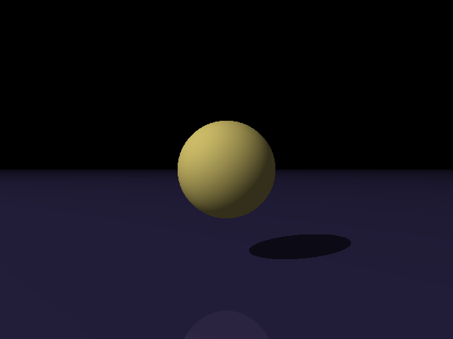
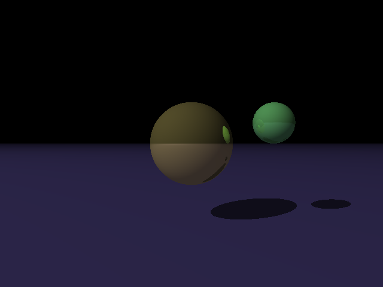
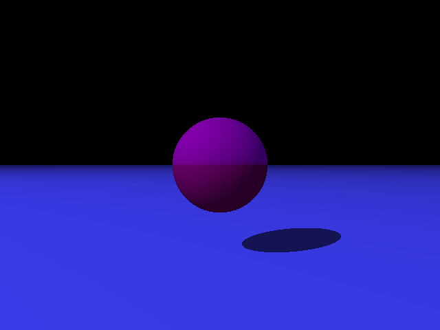

# Program 3 Input Files

Input files for [Part 3](http://iondune.github.io/csc473/project/part3) of the [ray tracer project](http://iondune.github.io/csc473/project/).

| File      | Notes                                                                              |
|-----------|------------------------------------------------------------------------------------|

## Output Images

### simple_tri.pov

### simple_reflect1.pov

### simple_reflect2.pov

### simple_reflect3.pov

### simple_refract.pov

### refract2.pov

### refract_refl.pov

### recurse_simp2.pov

