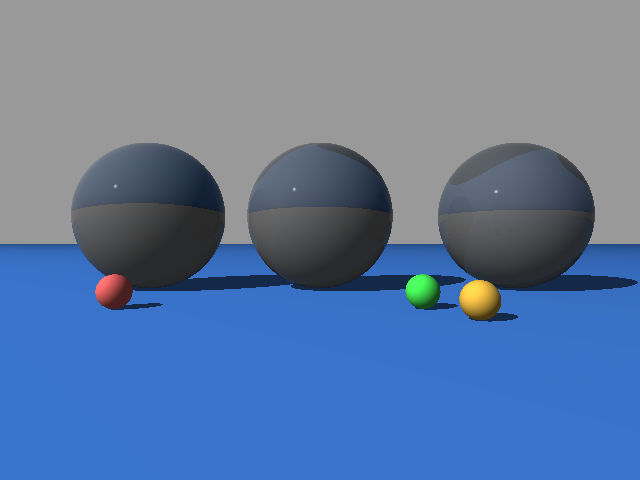
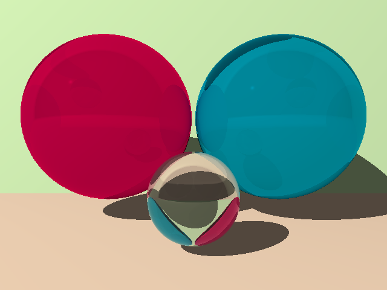

# Program 4 Input Files

Input files for [Part 4](http://iondune.github.io/csc473/project/part4) of the [ray tracer project](http://iondune.github.io/csc473/project/).

| File      | Notes                                                                              |
|-----------|------------------------------------------------------------------------------------|
| test1     | printrays command (valentine2.pov)                                                 |
| test2     | printrays command (valentine2.pov)                                                 |

## Output Images

### valentine2.pov

### fresnel1.pov

**Arguments:** `-fresnel`

### fresnel2.pov

**Arguments:** `-fresnel`

### fresnel3.pov

**Arguments:** `-fresnel`

### shiny.pov

**Arguments:** `-ss=2`

### simple.pov

**Arguments:** `-ss=3`

### beers.pov

