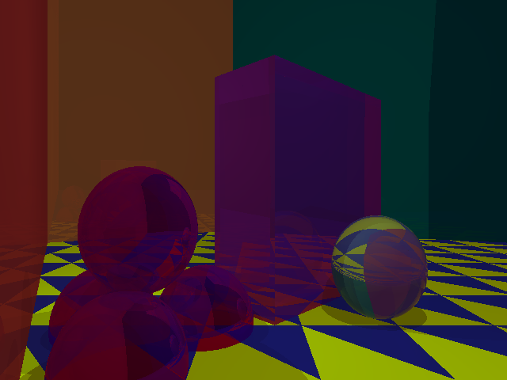
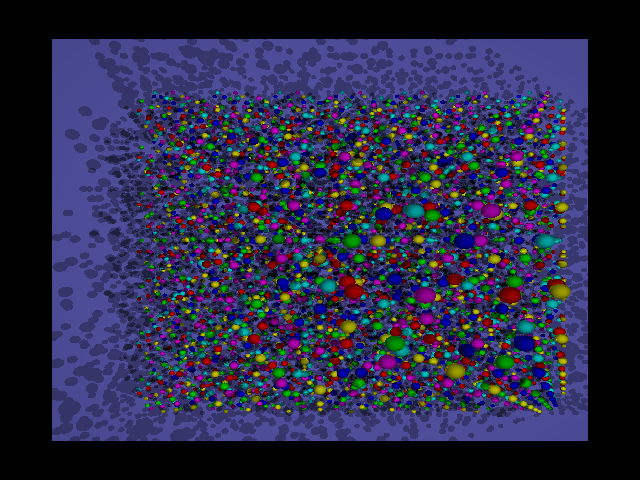

# Program 5 Input Files

Input files for [Part 5](http://iondune.github.io/csc473/project/part5) of the [ray tracer project](http://iondune.github.io/csc473/project/).

## Output Images

### box_nr.pov

### box2.pov

### box_refract.pov

### checkerbox.pov

**Arguments:** `-fresnel`

### balls2.pov

**Arguments:** `-sds`

### bunny.pov

**Arguments:** `-sds`

### gnarly.pov

**Arguments:** `-sds`

